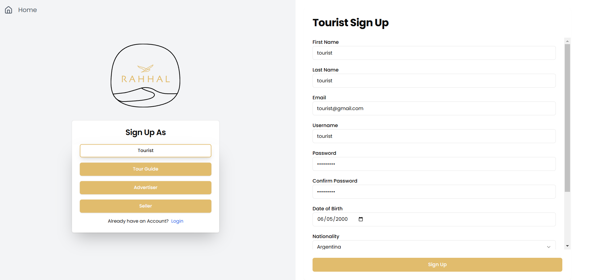
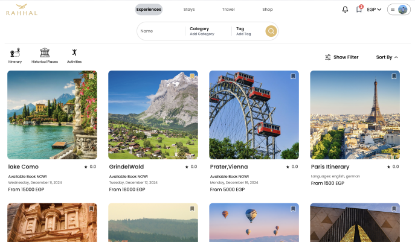
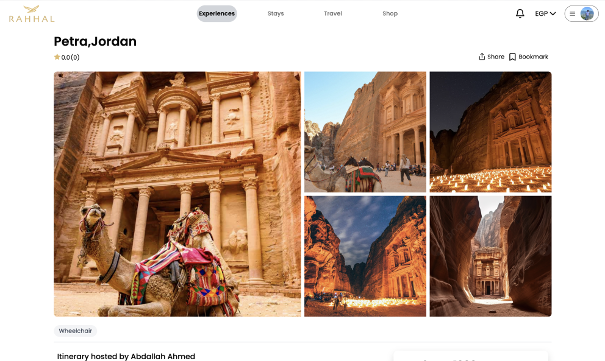
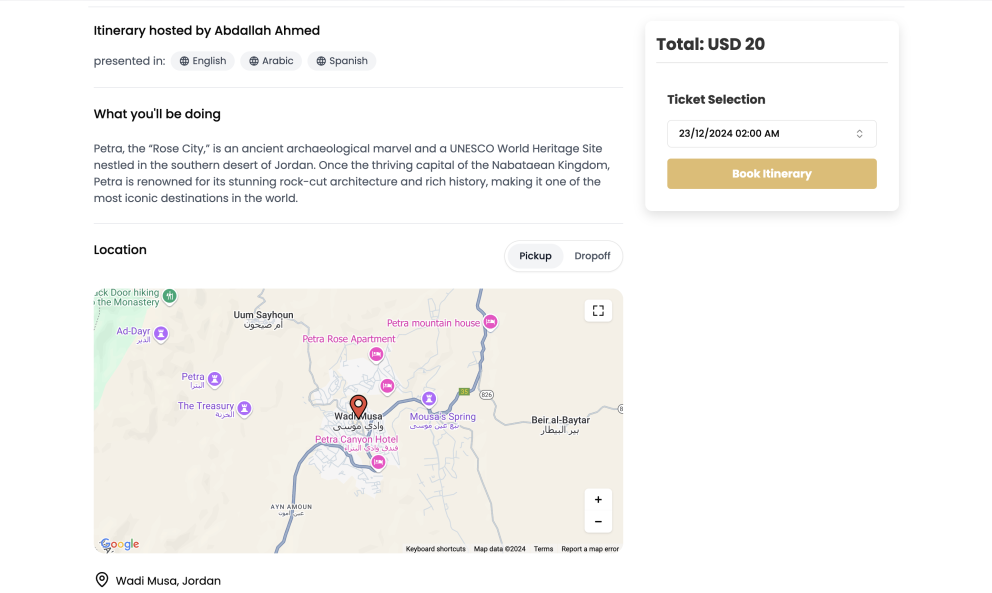
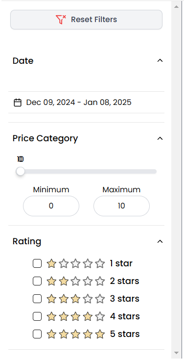
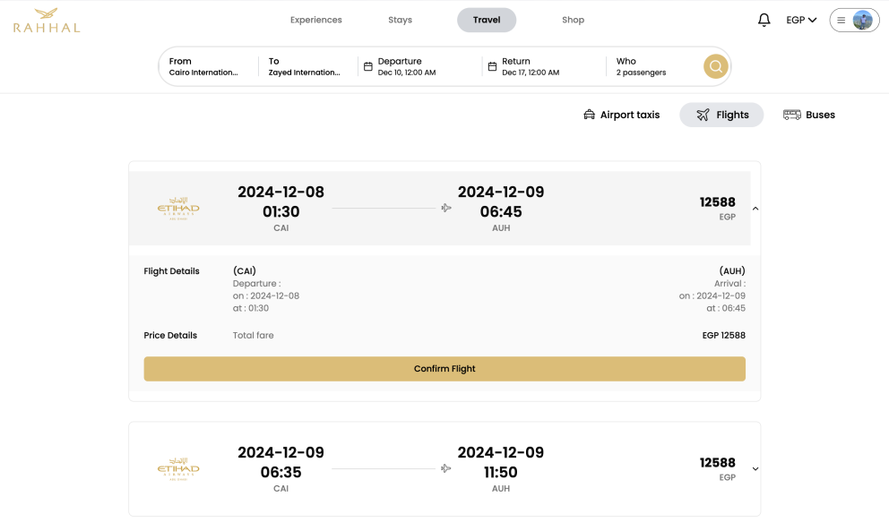
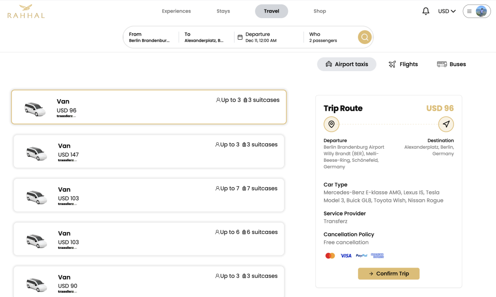
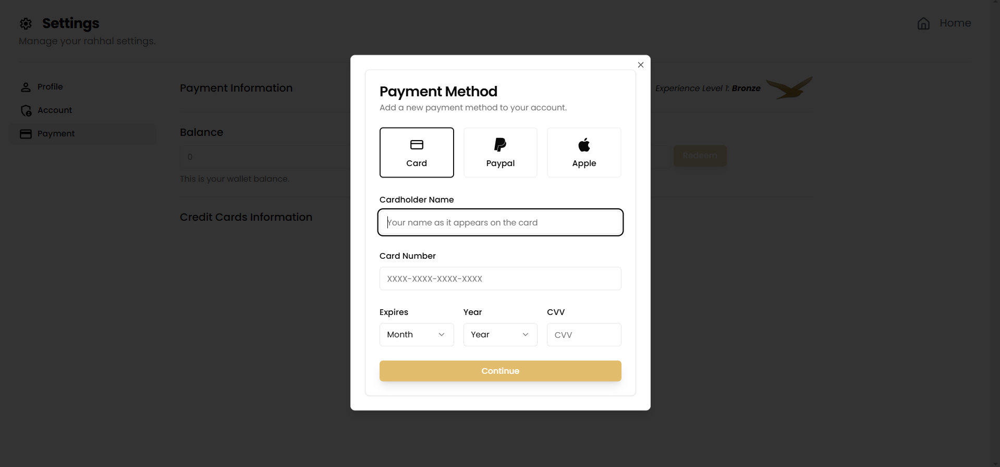
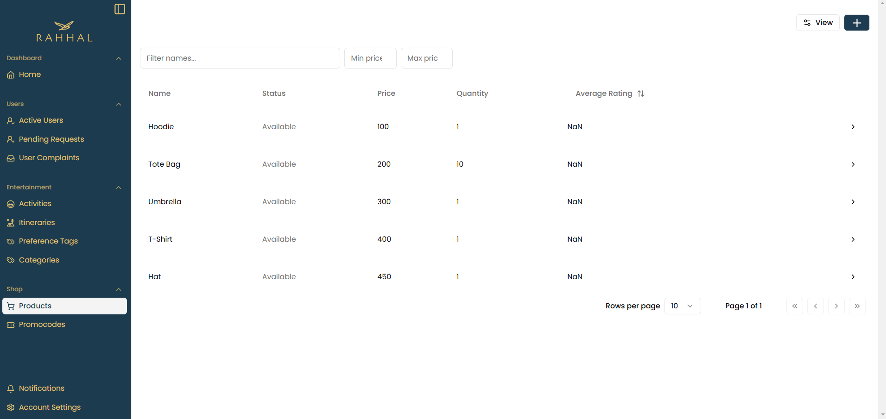

# Rahhal

## API Reference


## Testing
We are using `vitest`. To run the tests, execute the following commands in the root directory of the project.

```bash
> chmod +x run-tests.sh
> ./run-tests.sh
```

## Installation
```bash
> git clone https://github.com/Advanced-computer-lab-2024/Rahhal.git
> cd Rahhal
> docker compose up --build
```

## Credits
- [shadcn](https://ui.shadcn.com)
- [RabbitMQ Docs](https://www.rabbitmq.com/docs)
- [Stripe docs](https://stripe.com/docs)
- [TypeScript Crash Course](https://www.youtube.com/watch?v=BCg4U1FzODs)
- [React Crash Course](https://www.youtube.com/watch?v=LDB4uaJ87e0&pp=ygUbcmVhY3QgY291cnNlIHRyYXZlcnN5IG1lZGlh)
- [Tailwind CSS Crash Course](https://www.youtube.com/watch?v=dFgzHOX84xQ)
- [Vite Crash Course](https://www.youtube.com/watch?v=89NJdbYTgJ8&pp=ygUEVml0ZQ%3D%3D)
- [React Query Hook + Zod](https://www.youtube.com/watch?v=u6PQ5xZAv7Q)
- [MongoDB Crash Course](https://www.youtube.com/watch?v=DZBGEVgL2eE&pp=ygUUTW9uZ29zZSBjcmFzaCBjb3Vyc2U%3D)
- [How to build NodeJS Microservice - NodeJS Monolithic to Microservice Architecture](https://www.youtube.com/watch?v=EXDkgjU8DDU&list=PLaLqLOj2bk9ZV2RhqXzABUP5QSg42uJEs&index=1&pp=iAQB)

## Motivation

Welcome to Rahhal, your all-in-one travel planner! We created Rahhal to simplify vacation planning by offering personalized itineraries, seamless bookings, and budget-friendly suggestions all in one platform. Whether you’re exploring historic sites, relaxing on beaches, or discovering local gems, Rahhal makes it easy to plan and enjoy your perfect trip. Stay organized with real-time updates, expert tours, and exclusive local experiences. Start your journey stress-free with Rahhal!

## Tech and Frameworks used

- [Node.js](https://nodejs.org/en/)
- [Express](https://expressjs.com/)
- [React](https://reactjs.org/)
- [MongoDB](https://www.mongodb.com/)
- [Mongoose](https://mongoosejs.com/)
- [firebase](https://firebase.google.com/)
- [swagger](https://swagger.io/)
- [Stripe](https://stripe.com/)
- [prettier](https://prettier.io/)
- [Git](https://git-scm.com/)
- [MongoDB Atlas](https://www.mongodb.com/cloud/atlas)
- [Postman](https://www.postman.com/)
- [VSCode](https://code.visualstudio.com/)
- [JWT](https://jwt.io/)
- [Docker](https://www.docker.com/)
- [ESlint](https://eslint.org/)
- [Husky](https://github.com/typicode/husky/tree/main)

## How To Use

- Add a `.env` file for the environment variables in the root directory of the project for each service

### Client (Frontend)
```bash
PORT
GOOGLE_MAPS_API_KEY
EXCHANGE_RATES_API_KEY
AMADEUS_AUTH_URL
AMADEUS_TRANSFER_URL
AMADEUS_API_KEY
AMADEUS_API_SECRET
STORAGE_BUCKET
GOOGLE_MAPS_API_KEY
```

### API-Gateway
```bash
PORT
GOOGLE_MAPS_API_KEY
EXCHANGE_RATES_API_KEY
STORAGE_BUCKET
```

### Authentication
```bash
SECRETKEY
PORT
MONGODB_URI
```

### User
```bash
PORT
MONGODB_URI
```

### Product
```bash
PORT
MONGODB_URI
```

### Order
```bash
PORT
MONGODB_URI
```

### Payment
```bash
PORT
MONGODB_URI
STRIPE_SECRET_KEY
STRIPE_PUBLISH_KEY
```

### Notification
```bash
PORT
MONGODB_URI
SMTP_HOST
SMTP_PORT
SMTP_USER
SMTP_PASS
```

### Entertainment
```bash
PORT
MONGODB_URI
```

### Booking
```bash
PORT
MONGODB_URI
```

## License

The software is open source under the Apache 2.0 License.

- [Apache 2.0](https://www.apache.org/licenses/LICENSE-2.0)

## Build Status

- Our project is currently under active development and not recommended for production environments.
- Preliminary testing completed
- Check Issues for a list of all the reported issues.
- Ongoing enhancements and feature improvements planned.
- Additional automated tests to be implemented.
- Performance and scalability optimizations in progress.

## Features
Our system serves different types of users (Guest, Tourist, Admin, Seller, Tour Guide, Advertiser, Tourism Governor)

<details>
<summary> As a Guest I can </summary>

- Register as a tourist with essential details.
- Register as a seller/tour guide/advertiser with username, email, and password.
- Upload and submit required documents upon registration as a seller/tour guide/advertiser.
- View step-by-step vacation guide.
- Choose a category of activities.
- Browse all upcoming activities, itineraries, and historical places/museums.
- Filter historical places/museums by tag.
- Sort and filter all upcoming activities/itineraries by various criteria.

</details>

<details>
<summary> As a Tourist I can </summary>

- Register and log in to the platform using username/email and password.
- Update personal profile, including preferences, contact details, wallet, and password.
- Delete my account.
- Reset password by receiving an OTP sent to the registered email address.
- View step-by-step vacation guide.
- Choose a category of activities.
- Browse all upcoming activities, itineraries, and historical places/museums.
- Filter historical places/museums by tag.
- Sort and filter all upcoming activities/itineraries.
- Receive personalized recommendations based on my preferences.
- Book tickets for events, activities, and itineraries.
- Pay online using credit/debit card or wallet.
- Cancel bookings within 48 hours.
- Receive payment receipts via email.
- View upcoming and past bookings.
- Select vacation preferences.
- Choose currency for viewing prices.
- Bookmark and save events.
- Request event booking notifications.
- Receive event reminders via app and email.
- Rate and comment on tour guides, itineraries, and activities.
- Share activities and itineraries.
- Book complementary services (flights, hotels, transportation).
- Earn loyalty points on payments.
- Receive badges based on point levels.
- Redeem points for wallet credit.
- Browse and search products.
- Manage wishlist.
- Add items to cart.
- Checkout with multiple payment options.
- Manage orders.
- Rate and review purchased products.
- File and track complaints.

</details>

<details>
<summary> As an Admin I can </summary>

- Add tourism governors and admins.
- View and manage user registrations.
- Delete user accounts.
- Monitor user statistics.
- Manage activity categories and tags.
- Create and manage preference tags.
- Flag inappropriate events.
- View sales reports.
- View and manage user complaints.
- Respond to and resolve complaints.
- Add new products with comprehensive details.
- View product details including available quantity and sales.
- Search and filter products.
- Create promotional codes.
- Manage product listings (add, edit, archive).

</details>

<details>
<summary> As a Tour Guide I can </summary>

- Create and manage professional profile.
- Upload profile picture.
- Manage itinerary creation and management.
- Activate/deactivate itineraries.
- Receive notifications about flagged content.
- View a list of all created itineraries.
- View sales reports.
- Filter sales data.
- Track tourist engagement.

</details>

<details>
<summary> As an Advertiser I can </summary>

- Create and manage company profile.
- Upload company logo.
- Manage activity listings.
- Receive notifications about flagged content.
- View sales reports.
- Filter sales data.
- Track tourist engagement.
- View a list of all created activities.

</details>

<details>
<summary> As a Seller I can </summary>

- Create and manage seller profile.
- View sales reports.
- Add new products with full details.
- Upload product images.
- Edit product details and pricing.
- Search products by name.
- Filter products by price.
- Sort products by ratings.
- View product inventory and sales.
- Archive and unarchive products.
- Receive notifications when a product goes out of stock.

</details>

<details>
<summary> As a Tourism Governor I can </summary>

- Create and manage my profile.
- Create, update, and delete museums and historical places.
- Add detailed location information.
- Define ticket prices for different visitor categories (foreigner, native, student).
- Create tags for historical locations.
- Define location types (Monuments, Museums, Religious Sites, Palaces/Castles).
- View list of created museums and historical places.

</details>


## Code Examples


<details>
    <summary>
    BE Routes Example
    </summary>

```javascript
app.use("/api/user", userRoutes);
app.use("/api/product", productRoutes);
app.use("/api/booking", bookingRoutes);
app.use("/api/firebase", firebaseRoutes);
app.use("/api/google-maps", googleMapsRoutes);
app.use("/api/entertainment", entertainmentRoutes);
app.use("/api/flights-search", flightSearchRoutes);
app.use("/api/exchange-rates", exchangeRatesRoutes);
app.use("/api/transportation", transportationRoutes);
app.use("/api/rating", ratingRoutes);
app.use("/api/order", orderRoutes);
app.use("/api/external-api", externalApiRoutes);
app.use("/api/payment", paymentRoutes);

```
</details>


<details>
   <summary>
   BE Create Itinerary Controller Example 
   </summary>

```javascript

export async function createItinerary(req: express.Request, res: express.Response) {
  try {
    const itinerary = await itinerariesService.createItinerary(req.body);
    res.status(STATUS_CODES.CREATED).json(itinerary);
  } catch (error: unknown) {
    res.status(STATUS_CODES.SERVER_ERROR).json({
      message: error instanceof Error ? error.message : "An unknown error occurred",
    });
  }
}


```
</details>


<details>
   <summary>
   BE Create Itinerary Service Example 
   </summary>

```javascript

export async function createItinerary(itineraryData: IItinerary) {
  return itinerariesRepository.createItinerary(itineraryData);
}

```
</details>


<details>
   <summary>
   BE Itinerary Model Example 
   </summary>

```javascript

import type { IRating } from "../../database/shared";
import {
  ratingSchema,
  validateListNotEmpty,
  validateRatings,
  validateStringNotEmpty,
} from "../../database/shared";
import * as itineraryValidator from "../validators/itineraries-validator";
import mongoose from "mongoose";

const itinerarySchema = new mongoose.Schema<IItinerary>({
  name: {
    type: String,
    required: true,
    validate: {
      validator: validateStringNotEmpty,
      message: "Itinerary name must not be empty",
    },
  },
  description: {
    type: String,
    required: true,
    validate: {
      validator: validateStringNotEmpty,
      message: "Itinerary description must not be empty",
    },
  },
  activities: { type: [String], required: true },
  images: { type: [String], required: true },
  locations: {
    type: [
      {
        longitude: { type: Number, required: true },
        latitude: { type: Number, required: true },
        placeId: { type: String },
      },
    ],
    required: true,
    validate: [
      itineraryValidator.validateLocations,
      "Invalid location coordinates: Longitude must be between -180 and 180, latitude must be between -90 and 90",
    ],
  },
  timeline: {
    type: String,
    required: true,
    validate: {
      validator: validateStringNotEmpty,
      message: "Itinerary timeline must not be empty",
    },
  },
  durationOfActivities: {
    type: [String],
    required: true,
    validate: {
      validator: validateListNotEmpty,
      message: "Itinerary duration of activities must not be empty",
    },
  },
  languages: { type: [String], required: true },
  price: {
    type: mongoose.Schema.Types.Mixed,
    required: true,
    validate: {
      validator: itineraryValidator.validateTourPrice,
      message: "Invalid price format, must be a number or an object { min: number, max: number }",
    },
  },
  availableDatesTime: {
    type: [
      {
        Date: { type: Date, required: true },
        Time: { type: Date, required: true },
      },
    ],
    required: true,
  },
  accessibility: {
    type: String,
    required: true,
    validate: {
      validator: validateStringNotEmpty,
      message: "Itinerary accessibility must not be empty",
    },
  },
  pickUpLocation: {
    type: {
      longitude: { type: Number, required: true },
      latitude: { type: Number, required: true },
      placeId: { type: String },
    },
    required: true,
  },
  dropOffLocation: {
    type: {
      longitude: { type: Number, required: true },
      latitude: { type: Number, required: true },
      placeId: { type: String },
    },
    required: true,
  },
  ratings: {
    type: [ratingSchema],
    validate: {
      validator: validateRatings,
      message: "Invalid rating format, must be a number between 0 and 5",
    },
  },
  preferenceTags: { type: [mongoose.Schema.Types.ObjectId], ref: "PreferenceTag" },
  category: {
    type: mongoose.Schema.Types.ObjectId,
    ref: "Category",
    required: true,
    validate: {
      validator: validateStringNotEmpty,
      message: "Itinerary category must not be empty",
    },
  },
  active: { type: Boolean, required: true, default: true },
  appropriate: { type: Boolean, required: true, default: true },
  owner: {
    type: String,
    required: true,
    validate: {
      validator: validateStringNotEmpty,
      message: "Itinerary owner must not be empty",
    },
  },
  ownerName: {
    type: String,
    required: true,
    validate: {
      validator: validateStringNotEmpty,
      message: "Itinerary owner name must not be empty",
    },
  },

  deleted: { type: Boolean, default: false },
});

const Itinerary = mongoose.model<IItinerary>("Itinerary", itinerarySchema);
export default Itinerary;

```
</details>


<details>
   <summary>
    Create Itinerary Validator Example 
   </summary>

```javascript
import { CONSTANTS } from "../../utils/constants";

// Validate location coordinates to be within the range of longitude -180 to 180 and latitude -90 to 90
export function validateLocations(locations: [{ longitude: number; latitude: number }]) {
  return locations.every((location) => {
    return (
      location.longitude >= CONSTANTS.MIN_LONGITUDE &&
      location.longitude <= CONSTANTS.MAX_LONGITUDE &&
      location.latitude >= CONSTANTS.MIN_LATITUDE &&
      location.latitude <= CONSTANTS.MAX_LATITUDE
    );
  });
}

// Validate price format to be a number or an object { min: number, max: number } and to be greater than or equal to 0
export function validateTourPrice(tour_price: number | { min: number; max: number }) {
  if (typeof tour_price === "number") {
    return tour_price >= CONSTANTS.ZERO;
  } else if (typeof tour_price === "object") {
    return tour_price.min >= CONSTANTS.ZERO && tour_price.max > tour_price.min;
  }
  return false;
}

// Validate rating format to be a number between 0 and 5
export function validateRating(ratings: number[]) {
  return ratings.every(
    (rating) => rating >= CONSTANTS.MIN_RATING && rating <= CONSTANTS.MAX_RATING,
  );
}


```
</details>

<details>
   <summary>
   Itinerary TypeScripts Type Example 
   </summary>

```javascript

export const RatingSchema = z.object({
  userId: z.string(),
  userName: z.string(),
  rating: z.number(),
  review: z.string().optional(),
});

export type TRating = {
  userId: string;
  userName: string;
  rating: number;
  review?: string;
};

export interface IItinerary {
  _id: string;
  name: string;
  description: string;
  activities: string[];
  locations: [{ longitude: number; latitude: number }];
  timeline: string;
  duarationOfActivities: string[];
  images: string[];
  languages: string[];
  price: number | { min: number; max: number };
  availableDatesTime: { Date: Date; Time: Date }[];
  accessibility: string;
  pickUpLocation: { longitude: number; latitude: number };
  dropOffLocation: { longitude: number; latitude: number };
  ratings?: TRating[];
  preferenceTags?: PreferenceTag[];
  category?: Category;
  owner: string;
}


```
</details>


<details>
   <summary>
   FE Create Itinerary Example 
   </summary>

```javascript

export async function createItinerary(
  newItineraryData: TNewItinerary,
  userId: string,
  username: string,
  itineraryImages: FileList | null,
) {
  newItineraryData.owner = userId;
  newItineraryData.ownerName = username;
  const response = await axios.post(SERVICES_URLS.ENTERTAINMENT + "/itineraries", newItineraryData);
  const itineraryId = (response.data as TItinerary)._id;
  const urls: string[] = await uploadToFirebase(
    itineraryImages,
    userId,
    itineraryId,
    renameItineraryImage,
  );

  newItineraryData.images = urls;

  await axios.patch(`${SERVICES_URLS.ENTERTAINMENT}/itineraries/${itineraryId}`, newItineraryData);

  alert("Itinerary created successfully");
  window.location.reload();
}


```
</details>

<details>
   <summary>
   FE Tour Guide Itinerary Sales Report Example
   </summary>

```javascript
import { useEffect, useState } from "react";
import GenericSalesReport, {
  ReportFilters,
  SalesItem,
} from "../../../components/GenericSalesReport";
import { fetchBookingsByDateRange, getBookingsWithFilters } from "@/api-calls/booking-api-calls";
import { TPopulatedBooking } from "@/features/home/types/home-page-types";
import { fetchItineraries } from "@/api-calls/itineraries-api-calls";
import { TItinerary } from "@/features/admin/utils/columns-definitions/itineraries-columns";

export default function ItineraryReport() {
  const [salesData, setSalesData] = useState<SalesItem[]>([]);
  const [filters, setFilters] = useState<ReportFilters | null>(null);

  useEffect(() => {
    const apiFilters = {
      type: "itinerary",
      status: "completed",
    };

    let salesItems: SalesItem[] = [];

    if (!filters) {
      getBookingsWithFilters(apiFilters).then((value) => {
        const bookings = value as TPopulatedBooking[];

        salesItems = bookings
          .filter((booking) => booking._id)
          .map((booking) => ({
            id: booking.entity._id!,
            name: booking.entity.name,
            type: "itinerary",
            price: booking.selectedPrice,
            date: new Date(booking.selectedDate).toISOString(),
            quantity: 1,
            status: booking.status,
            tourists: 1,
          }));
        
      });
    } else {
      const startDate = filters.dateRange[0];
      const endDate = filters.dateRange[1];

      fetchBookingsByDateRange(startDate, endDate, apiFilters).then((value) => {
        const bookings = value as TPopulatedBooking[];

        salesItems = bookings
          .filter((booking) => booking._id)
          .map((booking) => ({
            id: booking.entity._id!,
            name: booking.entity.name,
            type: "itinerary",
            price: booking.selectedPrice,
            date: new Date(booking.selectedDate).toISOString(),
            quantity: 1,
            status: booking.status,
            tourists: 1,
          }));
        
      });
    }

    // get rest of itineraries that are not in bookings
    fetchItineraries().then((value) => {
      const itineraries = value as TItinerary[];

      const itinerariesNotInBookings: SalesItem[] = itineraries
        .filter((itinerary) => !salesData.find((item) => item.id === itinerary._id))
        .map((itinerary) => ({
          id: itinerary._id,
          name: itinerary.name,
          type: "itinerary",
          price: itinerary.price,
          date: new Date().toISOString(),
          quantity: 0,
          status: "not_sold",
          tourists: 0,
        }));

      setSalesData([...salesData, ...itinerariesNotInBookings, ...salesItems]);
    });
  }, [filters]);

  return (
    <GenericSalesReport
      data={salesData}
      type="itinerary"
      onFilterChange={(filters: ReportFilters) => setFilters(filters)}
    />
  );
}


```
</details>


<details>
   <summary>
   FE Notification Popover Component Example
   </summary>

```javascript

import { Bell, MailOpen, MailCheck } from "lucide-react";
import { Popover, PopoverTrigger, PopoverContent } from "@/components/ui/popover";
import { Button } from "@/components/ui/button";
import { Card, CardHeader, CardTitle, CardContent } from "@/components/ui/card";
import useSSE from "@/hooks/use-sse";
import { useState, useEffect } from "react";
import { SERVICES_URLS } from "@/lib/constants";
import {
  fetchUserNotifications,
  markUserNotificationsAsSeen,
} from "@/api-calls/notifications-api-calls";
import type { INotification } from "@/types/shared.d.ts";
import { ScrollArea } from "@/components/ui/scroll-area";
import { SidebarMenuButton } from "@/components/ui/sidebar";
import { cn } from "@/lib/utils";

interface NotificationPopoverProps {
  userId: string;
  isAdmin?: boolean;
}

export default function NotificaionPopover({ userId, isAdmin = false }: NotificationPopoverProps) {
  const [notifications, setNotifications] = useState<INotification[]>([]);

  // Fetch initial notifications on mount
  useEffect(() => {
    const fetchInitialNotifications = async () => {
      try {
        const initialNotifications = await fetchUserNotifications(userId);
        setNotifications(initialNotifications);
      } catch (error) {
        console.error("Failed to fetch notifications:", error);
      }
    };

    fetchInitialNotifications();
  }, [userId]);

  async function markAllAsRead() {
    await markUserNotificationsAsSeen(userId);
    setNotifications((prev) => prev.map((notification) => ({ ...notification, seen: true })));
  }

  useSSE(
    SERVICES_URLS.NOTIFICATION + "/notifications/stream",
    userId,
    (newNotification: INotification) => {
      setNotifications((prev) => {
        const exists = prev.some((n) => n._id === newNotification._id);
        if (exists) return prev;
        return [newNotification, ...prev];
      });
    },
  );

  return (
    <Popover>
      <PopoverTrigger asChild>
        {isAdmin ? (
          <div className="pt-1">
            <SidebarMenuButton asChild tooltip="Notifications">
              <a>
                <Bell />
                <span>Notifications</span>
              </a>
            </SidebarMenuButton>
          </div>
        ) : (
          <Button variant="clean" size="icon" className="relative group">
            <Bell className="h-6 w-6 transition-transform duration-200 ease-in-out group-hover:scale-110" />
            {notifications.filter((notification) => !notification.seen).length > 0 && (
              <span className="absolute -top-0.5 -right-0.5 h-5 w-5 bg-red-500 rounded-full text-xs text-primary-foreground flex items-center justify-center transition-transform duration-200 ease-in-out group-hover:scale-110">
                {notifications.filter((notification) => !notification.seen).length}
              </span>
            )}
          </Button>
        )}
      </PopoverTrigger>
      {isAdmin && (
        <>
          {notifications.filter((notification) => !notification.seen).length > 0 && (
            <span className="absolute bottom-16 left-5 h-4 w-4 bg-red-500 rounded-full text-xs text-primary-foreground flex items-center justify-center transition-transform duration-200 ease-in-out group-hover:scale-110">
              {notifications.filter((notification) => !notification.seen).length}
            </span>
          )}
        </>
      )}
      <PopoverContent className={cn("p-0 w-[400px]", isAdmin && "ml-10")}>
        <Card className="shadow-none border-0">
          <CardHeader className="border-b px-6 py-4">
            <div className="flex items-center justify-between">
              <CardTitle>Notifications</CardTitle>
              {notifications.length > 0 && (
                <Button variant="ghost" size="sm" onClick={markAllAsRead}>
                  Mark all as read
                </Button>
              )}
            </div>
          </CardHeader>
          <CardContent className="p-6 space-y-4">
            <ScrollArea className="flex max-h-80 flex-col overflow-y-auto ">
              <div className="grid gap-4">
                {notifications.length > 0 ? (
                  notifications.map((notification, index) => (
                    <div className="grid grid-cols-[32px_1fr] items-start gap-4">
                      {notification.seen ? (
                        <div className="rounded-full bg-green-500 p-2 text-blue-50">
                          <MailCheck className="w-4 h-4" />
                        </div>
                      ) : (
                        <div className="rounded-full bg-blue-500 p-2 text-blue-50">
                          <MailOpen className="w-4 h-4" />
                        </div>
                      )}
                      <div>
                        <p className="text-sm font-medium">System Notification</p>
                        <p className="text-sm text-muted-foreground">{notification.message}.</p>
                      </div>
                    </div>
                  ))
                ) : (
                  <p> You don't have any notifications for now</p>
                )}
              </div>
            </ScrollArea>
          </CardContent>
        </Card>
      </PopoverContent>
    </Popover>
  );
}

```
</details>


## Contribute 
We welcome contributions to Rahhal! if you wish to contribute , it's as simple as:

1. Fork the repository
2. Clone the repository
3. Install dependencies
4. Create a new branch (git checkout -b my-new-feature)
5. Make your changes
6. Commit your changes (git commit -am 'Add some feature')
7. Push to the branch (git push origin my-new-feature)
8. Create a pull request
9. Wait for your pull request to be reviewed and merged


## Code Examples


<details>
    <summary>
    BE Routes Example
    </summary>

```javascript
app.use("/api/user", userRoutes);
app.use("/api/product", productRoutes);
app.use("/api/booking", bookingRoutes);
app.use("/api/firebase", firebaseRoutes);
app.use("/api/google-maps", googleMapsRoutes);
app.use("/api/entertainment", entertainmentRoutes);
app.use("/api/flights-search", flightSearchRoutes);
app.use("/api/exchange-rates", exchangeRatesRoutes);
app.use("/api/transportation", transportationRoutes);
app.use("/api/rating", ratingRoutes);
app.use("/api/order", orderRoutes);
app.use("/api/external-api", externalApiRoutes);
app.use("/api/payment", paymentRoutes);

```
</details>


<details>
   <summary>
   BE Create Itinerary Controller Example 
   </summary>

```javascript

export async function createItinerary(req: express.Request, res: express.Response) {
  try {
    const itinerary = await itinerariesService.createItinerary(req.body);
    res.status(STATUS_CODES.CREATED).json(itinerary);
  } catch (error: unknown) {
    res.status(STATUS_CODES.SERVER_ERROR).json({
      message: error instanceof Error ? error.message : "An unknown error occurred",
    });
  }
}


```
</details>


<details>
   <summary>
   BE Create Itinerary Service Example 
   </summary>

```javascript

export async function createItinerary(itineraryData: IItinerary) {
  return itinerariesRepository.createItinerary(itineraryData);
}

```
</details>


<details>
   <summary>
   BE Itinerary Model Example 
   </summary>

```javascript

import type { IRating } from "../../database/shared";
import {
  ratingSchema,
  validateListNotEmpty,
  validateRatings,
  validateStringNotEmpty,
} from "../../database/shared";
import * as itineraryValidator from "../validators/itineraries-validator";
import mongoose from "mongoose";

const itinerarySchema = new mongoose.Schema<IItinerary>({
  name: {
    type: String,
    required: true,
    validate: {
      validator: validateStringNotEmpty,
      message: "Itinerary name must not be empty",
    },
  },
  description: {
    type: String,
    required: true,
    validate: {
      validator: validateStringNotEmpty,
      message: "Itinerary description must not be empty",
    },
  },
  activities: { type: [String], required: true },
  images: { type: [String], required: true },
  locations: {
    type: [
      {
        longitude: { type: Number, required: true },
        latitude: { type: Number, required: true },
        placeId: { type: String },
      },
    ],
    required: true,
    validate: [
      itineraryValidator.validateLocations,
      "Invalid location coordinates: Longitude must be between -180 and 180, latitude must be between -90 and 90",
    ],
  },
  timeline: {
    type: String,
    required: true,
    validate: {
      validator: validateStringNotEmpty,
      message: "Itinerary timeline must not be empty",
    },
  },
  durationOfActivities: {
    type: [String],
    required: true,
    validate: {
      validator: validateListNotEmpty,
      message: "Itinerary duration of activities must not be empty",
    },
  },
  languages: { type: [String], required: true },
  price: {
    type: mongoose.Schema.Types.Mixed,
    required: true,
    validate: {
      validator: itineraryValidator.validateTourPrice,
      message: "Invalid price format, must be a number or an object { min: number, max: number }",
    },
  },
  availableDatesTime: {
    type: [
      {
        Date: { type: Date, required: true },
        Time: { type: Date, required: true },
      },
    ],
    required: true,
  },
  accessibility: {
    type: String,
    required: true,
    validate: {
      validator: validateStringNotEmpty,
      message: "Itinerary accessibility must not be empty",
    },
  },
  pickUpLocation: {
    type: {
      longitude: { type: Number, required: true },
      latitude: { type: Number, required: true },
      placeId: { type: String },
    },
    required: true,
  },
  dropOffLocation: {
    type: {
      longitude: { type: Number, required: true },
      latitude: { type: Number, required: true },
      placeId: { type: String },
    },
    required: true,
  },
  ratings: {
    type: [ratingSchema],
    validate: {
      validator: validateRatings,
      message: "Invalid rating format, must be a number between 0 and 5",
    },
  },
  preferenceTags: { type: [mongoose.Schema.Types.ObjectId], ref: "PreferenceTag" },
  category: {
    type: mongoose.Schema.Types.ObjectId,
    ref: "Category",
    required: true,
    validate: {
      validator: validateStringNotEmpty,
      message: "Itinerary category must not be empty",
    },
  },
  active: { type: Boolean, required: true, default: true },
  appropriate: { type: Boolean, required: true, default: true },
  owner: {
    type: String,
    required: true,
    validate: {
      validator: validateStringNotEmpty,
      message: "Itinerary owner must not be empty",
    },
  },
  ownerName: {
    type: String,
    required: true,
    validate: {
      validator: validateStringNotEmpty,
      message: "Itinerary owner name must not be empty",
    },
  },

  deleted: { type: Boolean, default: false },
});

const Itinerary = mongoose.model<IItinerary>("Itinerary", itinerarySchema);
export default Itinerary;

```
</details>


<details>
   <summary>
    Create Itinerary Validator Example 
   </summary>

```javascript
import { CONSTANTS } from "../../utils/constants";

// Validate location coordinates to be within the range of longitude -180 to 180 and latitude -90 to 90
export function validateLocations(locations: [{ longitude: number; latitude: number }]) {
  return locations.every((location) => {
    return (
      location.longitude >= CONSTANTS.MIN_LONGITUDE &&
      location.longitude <= CONSTANTS.MAX_LONGITUDE &&
      location.latitude >= CONSTANTS.MIN_LATITUDE &&
      location.latitude <= CONSTANTS.MAX_LATITUDE
    );
  });
}

// Validate price format to be a number or an object { min: number, max: number } and to be greater than or equal to 0
export function validateTourPrice(tour_price: number | { min: number; max: number }) {
  if (typeof tour_price === "number") {
    return tour_price >= CONSTANTS.ZERO;
  } else if (typeof tour_price === "object") {
    return tour_price.min >= CONSTANTS.ZERO && tour_price.max > tour_price.min;
  }
  return false;
}

// Validate rating format to be a number between 0 and 5
export function validateRating(ratings: number[]) {
  return ratings.every(
    (rating) => rating >= CONSTANTS.MIN_RATING && rating <= CONSTANTS.MAX_RATING,
  );
}


```
</details>

<details>
   <summary>
   Itinerary TypeScripts Type Example 
   </summary>

```javascript

export const RatingSchema = z.object({
  userId: z.string(),
  userName: z.string(),
  rating: z.number(),
  review: z.string().optional(),
});

export type TRating = {
  userId: string;
  userName: string;
  rating: number;
  review?: string;
};

export interface IItinerary {
  _id: string;
  name: string;
  description: string;
  activities: string[];
  locations: [{ longitude: number; latitude: number }];
  timeline: string;
  duarationOfActivities: string[];
  images: string[];
  languages: string[];
  price: number | { min: number; max: number };
  availableDatesTime: { Date: Date; Time: Date }[];
  accessibility: string;
  pickUpLocation: { longitude: number; latitude: number };
  dropOffLocation: { longitude: number; latitude: number };
  ratings?: TRating[];
  preferenceTags?: PreferenceTag[];
  category?: Category;
  owner: string;
}


```
</details>


<details>
   <summary>
   FE Create Itinerary Example 
   </summary>

```javascript

export async function createItinerary(
  newItineraryData: TNewItinerary,
  userId: string,
  username: string,
  itineraryImages: FileList | null,
) {
  newItineraryData.owner = userId;
  newItineraryData.ownerName = username;
  const response = await axios.post(SERVICES_URLS.ENTERTAINMENT + "/itineraries", newItineraryData);
  const itineraryId = (response.data as TItinerary)._id;
  const urls: string[] = await uploadToFirebase(
    itineraryImages,
    userId,
    itineraryId,
    renameItineraryImage,
  );

  newItineraryData.images = urls;

  await axios.patch(`${SERVICES_URLS.ENTERTAINMENT}/itineraries/${itineraryId}`, newItineraryData);

  alert("Itinerary created successfully");
  window.location.reload();
}


```
</details>

<details>
   <summary>
   FE Tour Guide Itinerary Sales Report Example
   </summary>

```javascript
import { useEffect, useState } from "react";
import GenericSalesReport, {
  ReportFilters,
  SalesItem,
} from "../../../components/GenericSalesReport";
import { fetchBookingsByDateRange, getBookingsWithFilters } from "@/api-calls/booking-api-calls";
import { TPopulatedBooking } from "@/features/home/types/home-page-types";
import { fetchItineraries } from "@/api-calls/itineraries-api-calls";
import { TItinerary } from "@/features/admin/utils/columns-definitions/itineraries-columns";

export default function ItineraryReport() {
  const [salesData, setSalesData] = useState<SalesItem[]>([]);
  const [filters, setFilters] = useState<ReportFilters | null>(null);

  useEffect(() => {
    const apiFilters = {
      type: "itinerary",
      status: "completed",
    };

    let salesItems: SalesItem[] = [];

    if (!filters) {
      getBookingsWithFilters(apiFilters).then((value) => {
        const bookings = value as TPopulatedBooking[];

        salesItems = bookings
          .filter((booking) => booking._id)
          .map((booking) => ({
            id: booking.entity._id!,
            name: booking.entity.name,
            type: "itinerary",
            price: booking.selectedPrice,
            date: new Date(booking.selectedDate).toISOString(),
            quantity: 1,
            status: booking.status,
            tourists: 1,
          }));
        
      });
    } else {
      const startDate = filters.dateRange[0];
      const endDate = filters.dateRange[1];

      fetchBookingsByDateRange(startDate, endDate, apiFilters).then((value) => {
        const bookings = value as TPopulatedBooking[];

        salesItems = bookings
          .filter((booking) => booking._id)
          .map((booking) => ({
            id: booking.entity._id!,
            name: booking.entity.name,
            type: "itinerary",
            price: booking.selectedPrice,
            date: new Date(booking.selectedDate).toISOString(),
            quantity: 1,
            status: booking.status,
            tourists: 1,
          }));
        
      });
    }

    // get rest of itineraries that are not in bookings
    fetchItineraries().then((value) => {
      const itineraries = value as TItinerary[];

      const itinerariesNotInBookings: SalesItem[] = itineraries
        .filter((itinerary) => !salesData.find((item) => item.id === itinerary._id))
        .map((itinerary) => ({
          id: itinerary._id,
          name: itinerary.name,
          type: "itinerary",
          price: itinerary.price,
          date: new Date().toISOString(),
          quantity: 0,
          status: "not_sold",
          tourists: 0,
        }));

      setSalesData([...salesData, ...itinerariesNotInBookings, ...salesItems]);
    });
  }, [filters]);

  return (
    <GenericSalesReport
      data={salesData}
      type="itinerary"
      onFilterChange={(filters: ReportFilters) => setFilters(filters)}
    />
  );
}


```
</details>


<details>
   <summary>
   FE Notification Popover Component Example
   </summary>

```javascript

import { Bell, MailOpen, MailCheck } from "lucide-react";
import { Popover, PopoverTrigger, PopoverContent } from "@/components/ui/popover";
import { Button } from "@/components/ui/button";
import { Card, CardHeader, CardTitle, CardContent } from "@/components/ui/card";
import useSSE from "@/hooks/use-sse";
import { useState, useEffect } from "react";
import { SERVICES_URLS } from "@/lib/constants";
import {
  fetchUserNotifications,
  markUserNotificationsAsSeen,
} from "@/api-calls/notifications-api-calls";
import type { INotification } from "@/types/shared.d.ts";
import { ScrollArea } from "@/components/ui/scroll-area";
import { SidebarMenuButton } from "@/components/ui/sidebar";
import { cn } from "@/lib/utils";

interface NotificationPopoverProps {
  userId: string;
  isAdmin?: boolean;
}

export default function NotificaionPopover({ userId, isAdmin = false }: NotificationPopoverProps) {
  const [notifications, setNotifications] = useState<INotification[]>([]);

  // Fetch initial notifications on mount
  useEffect(() => {
    const fetchInitialNotifications = async () => {
      try {
        const initialNotifications = await fetchUserNotifications(userId);
        setNotifications(initialNotifications);
      } catch (error) {
        console.error("Failed to fetch notifications:", error);
      }
    };

    fetchInitialNotifications();
  }, [userId]);

  async function markAllAsRead() {
    await markUserNotificationsAsSeen(userId);
    setNotifications((prev) => prev.map((notification) => ({ ...notification, seen: true })));
  }

  useSSE(
    SERVICES_URLS.NOTIFICATION + "/notifications/stream",
    userId,
    (newNotification: INotification) => {
      setNotifications((prev) => {
        const exists = prev.some((n) => n._id === newNotification._id);
        if (exists) return prev;
        return [newNotification, ...prev];
      });
    },
  );

  return (
    <Popover>
      <PopoverTrigger asChild>
        {isAdmin ? (
          <div className="pt-1">
            <SidebarMenuButton asChild tooltip="Notifications">
              <a>
                <Bell />
                <span>Notifications</span>
              </a>
            </SidebarMenuButton>
          </div>
        ) : (
          <Button variant="clean" size="icon" className="relative group">
            <Bell className="h-6 w-6 transition-transform duration-200 ease-in-out group-hover:scale-110" />
            {notifications.filter((notification) => !notification.seen).length > 0 && (
              <span className="absolute -top-0.5 -right-0.5 h-5 w-5 bg-red-500 rounded-full text-xs text-primary-foreground flex items-center justify-center transition-transform duration-200 ease-in-out group-hover:scale-110">
                {notifications.filter((notification) => !notification.seen).length}
              </span>
            )}
          </Button>
        )}
      </PopoverTrigger>
      {isAdmin && (
        <>
          {notifications.filter((notification) => !notification.seen).length > 0 && (
            <span className="absolute bottom-16 left-5 h-4 w-4 bg-red-500 rounded-full text-xs text-primary-foreground flex items-center justify-center transition-transform duration-200 ease-in-out group-hover:scale-110">
              {notifications.filter((notification) => !notification.seen).length}
            </span>
          )}
        </>
      )}
      <PopoverContent className={cn("p-0 w-[400px]", isAdmin && "ml-10")}>
        <Card className="shadow-none border-0">
          <CardHeader className="border-b px-6 py-4">
            <div className="flex items-center justify-between">
              <CardTitle>Notifications</CardTitle>
              {notifications.length > 0 && (
                <Button variant="ghost" size="sm" onClick={markAllAsRead}>
                  Mark all as read
                </Button>
              )}
            </div>
          </CardHeader>
          <CardContent className="p-6 space-y-4">
            <ScrollArea className="flex max-h-80 flex-col overflow-y-auto ">
              <div className="grid gap-4">
                {notifications.length > 0 ? (
                  notifications.map((notification, index) => (
                    <div className="grid grid-cols-[32px_1fr] items-start gap-4">
                      {notification.seen ? (
                        <div className="rounded-full bg-green-500 p-2 text-blue-50">
                          <MailCheck className="w-4 h-4" />
                        </div>
                      ) : (
                        <div className="rounded-full bg-blue-500 p-2 text-blue-50">
                          <MailOpen className="w-4 h-4" />
                        </div>
                      )}
                      <div>
                        <p className="text-sm font-medium">System Notification</p>
                        <p className="text-sm text-muted-foreground">{notification.message}.</p>
                      </div>
                    </div>
                  ))
                ) : (
                  <p> You don't have any notifications for now</p>
                )}
              </div>
            </ScrollArea>
          </CardContent>
        </Card>
      </PopoverContent>
    </Popover>
  );
}

```
</details>


## Contribute 
We welcome contributions to Rahhal! if you wish to contribute , it's as simple as:

1. Fork the repository
2. Clone the repository
3. Install dependencies
4. Create a new branch (git checkout -b my-new-feature)
5. Make your changes
6. Commit your changes (git commit -am 'Add some feature')
7. Push to the branch (git push origin my-new-feature)
8. Create a pull request
9. Wait for your pull request to be reviewed and merged


## Screenshots

<details>
<summary>Tourist Sign Up</summary>  
	
 
 
</details>

<details>
<summary>Home Page</summary>  
	
 
 
</details>

<details>
<summary>Itinerary Details Page</summary>  
	
 

 

 
</details>


<details>
<summary>Filter Sidebar</summary>  
	
 

 
</details>


<details>
<summary>Flights Home Page</summary>  
	
 
 
</details>


<details>
<summary>Taxi Home Page</summary>  
	
 
 
</details>


<details>
<summary>Add Payment Method</summary>  
	
 
 
</details>


<details>
<summary>Admin Products View</summary>  
	
 
 
</details>
